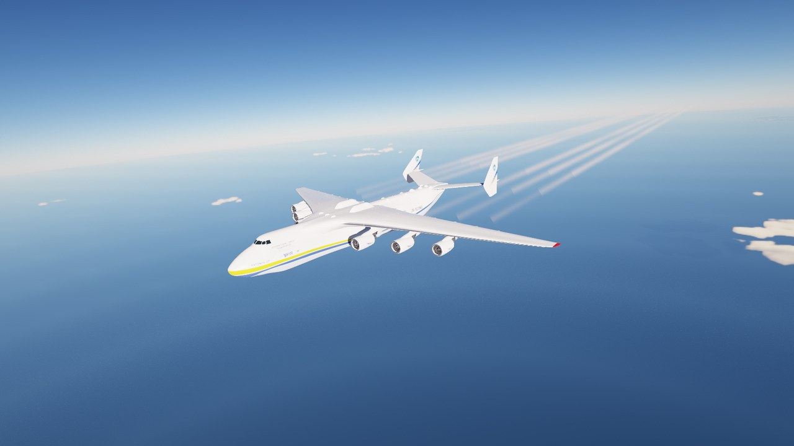
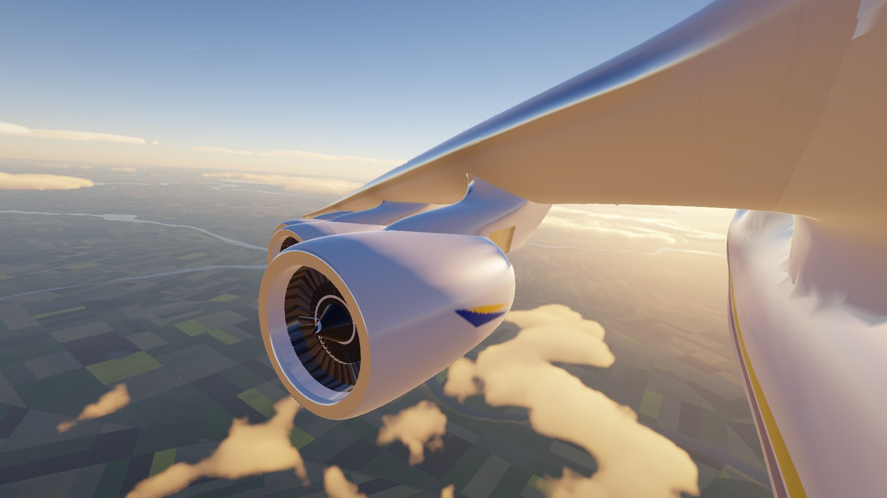
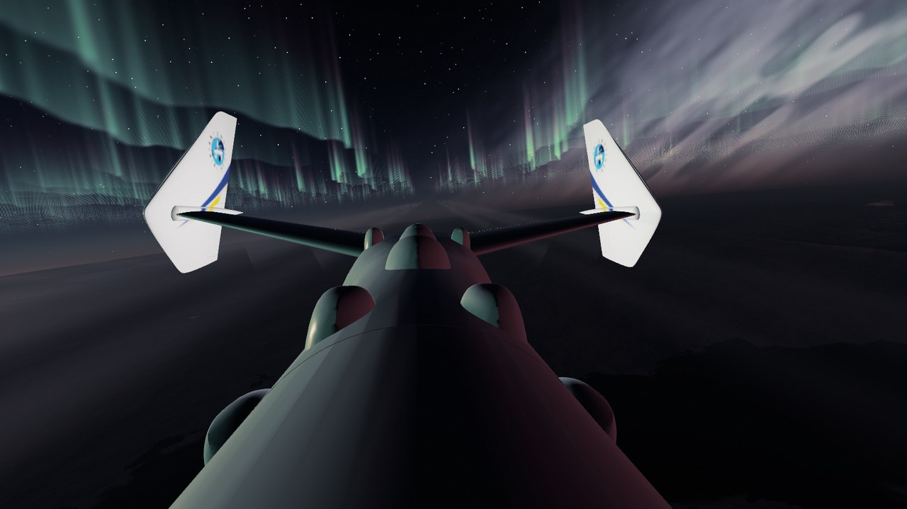
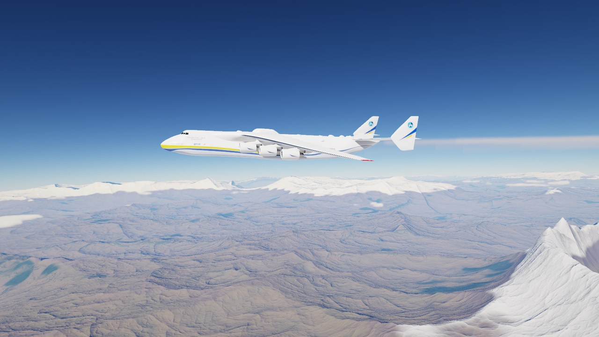
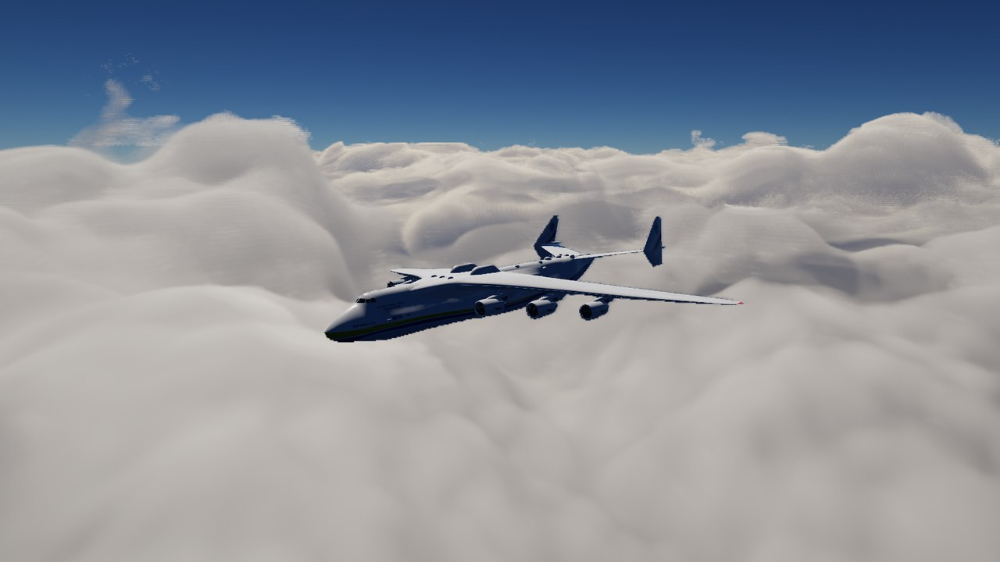

# Mriya

A 3D screensaver that flies you through volumetric clouds on the Antonov
An-225 *Mriya* - the largest aircraft ever built. Twenty-seven weather
scenarios, from a clear morning to a night thunderstorm and the aurora,
change gradually into one another over a procedural world; thirteen cameras
ride the airframe or fly alongside it; an autopilot flies a racetrack at
changing altitudes, and you can take the controls at any time with the
keyboard or a joystick.



The 3D engine and the tooling come from
[The Black Hole](https://github.com/ErickDoppler/Screensaver-TheBlackHole).

Status: **Windows: runs well.** **Linux (XScreenSaver): the code and scripts
are written, but not yet tested on Linux.**

| | |
|---|---|
|  |  |
|  |  |

## What it does

* **Clouds** are raymarched volumes: two layers of heaped and flat cloud, a
  cirrus veil, rain shafts and lightning, lit by a physically based sky
  (the sun, the moon and its phase, multiple scattering) and casting shadows
  on the ground. Fly into one and the world goes grey.
* **27 weather scenarios** - clear, cumulus, towering cumulus, thunderstorm,
  heavy rain, sea of clouds, sunset, sunrise, moonlit night, night storm,
  moonlit deck, cirrus, snowfall, haze, blue hour, desert dust, aurora,
  stratocumulus, altocumulus, tropical towers, between the layers, alpine,
  arctic day, drizzle, golden sea, stormy sunset and the Himalaya. None
  repeats until all have been shown. A change takes a minute: the sky turns
  and the ground reshapes itself under the aircraft - plains rising into
  ranges, the sea flooding in - then it holds for five.
* **Real time.** Give it a city and it flies in that place's daylight, sun and
  moon, and its live weather (from [Open-Meteo](https://open-meteo.com), no
  account needed; only the place is sent).
* **The aircraft** is a detailed model in the Antonov Airlines livery, drawn
  procedurally so every line is sharp at any distance: the cheatline measured
  off a reference texture, the titles set in type, glass windscreen panes,
  turning fans, a glowing turbine deep in each exhaust, working ailerons,
  elevators and rudders, flexing wings, contrails, navigation lights and
  strobes.
* **Flight model.** A 300-640 t freighter with the real aircraft's power: the
  stick asks for a pitch rate (3 deg/s slow, 10 deg/s from 540 km/h), the
  ceiling is wherever the thrust runs out, and a terrain floor 50 m above the
  ground takes over gently if you dive at it.
* **Thirteen cameras**, four views on most: the nose (with a flight HUD), the
  cockpit roof, the spine, the fin top, a wingtip, the side window, the chin,
  behind an engine, between the engines, the tailplane, a chase plane, a
  wingman, and a free orbit round the aircraft.

## Run it

### Windows

Everything is portable and open source. Nothing is installed system-wide
except the screensaver itself, no administrator rights are needed, and Visual
Studio is not needed.

1. **Get the build tools.** Downloads GCC ([w64devkit](https://github.com/skeeto/w64devkit)),
   CMake, Ninja and the SDL3 source into `C:\workenv`, checking every archive
   against a pinned SHA-256. Run it once; running it again only verifies what
   is already there.

   ```bat
   1-download-tools-windows.cmd
   ```

   To put the tools somewhere else, pass the folder
   (`1-download-tools-windows.cmd D:\tools`) and set `BH_WORKENV` to it before
   step 2.

2. **Build and install.** Compiles `build\win-mingw\Mriya.scr`, a single
   static executable with no runtime dependencies, checks it with Microsoft
   Defender, copies it to `%LOCALAPPDATA%\Mriya` and makes it the active
   screensaver for the current user. The first build takes a few minutes,
   because SDL3 is compiled from source.

   ```bat
   2-build-and-install-windows.cmd
   ```

Then open **Settings > Personalization > Lock screen > Screen saver** (or run
`control desk.cpl,,@screensaver`) to set the wait time; **Settings...** there
opens the screensaver's own options. The drop-down there lists only the
screensavers in `C:\Windows\System32`, so this one does not appear in it - it
is already selected, and picking any other entry replaces it.

**Install it with the script, not with Explorer's right-click "Install".**
The registry stores one path, and the script stores a permanent one. Explorer
pins the `.scr` wherever it happens to sit, so a copy in the build folder or
in Downloads stops working the moment it is deleted - and Windows then does
nothing at all on idle, without a word.

To look at it before installing, build with
`2-build-and-install-windows.cmd noinstall` and run
`build\win-mingw\Mriya.scr /w` for a window or `/s` for fullscreen. `Esc`
always exits.

#### It does not start, or something looks wrong

Every run writes a log to `%LOCALAPPDATA%\Mriya\last-run.log`: the graphics
card and driver, each start-up step, and the frame times. If it cannot start
its 3D graphics it says so in a message box that names the reason. On a laptop
with two graphics chips it runs on either; attach the log to an issue if it
misbehaves on yours.

#### Nothing happens on idle

The screensaver is whatever `SCRNSAVE.EXE` under `HKCU\Control Panel\Desktop`
points at. Check that path exists:

```powershell
Get-ItemProperty 'HKCU:\Control Panel\Desktop' | Select-Object 'SCRNSAVE.EXE', ScreenSaveActive, ScreenSaveTimeOut
```

* **It points at a file that is gone** - re-run `tools\install-windows.ps1`,
  which points it at the permanent copy.
* **`ScreenSaveTimeOut` is missing or 0** - Windows never starts a screensaver
  without one. The install script sets 600 seconds if it is unset.
* **Something is holding the display awake** - `powercfg /requests` lists what
  (a video call, a browser tab, a game).

### Linux

The screensaver runs inside [XScreenSaver](https://www.jwz.org/xscreensaver/),
which works on any X11 desktop (Xfce, MATE, Cinnamon, LXQt, i3 and others).
Debian/Ubuntu, Fedora, Arch and openSUSE are supported by the scripts.

> **Not yet tested on Linux.** The code and scripts are written, but have not
> yet been compiled or run on a Linux machine. Please report anything that
> fails.

1. **Get the build tools.** Installs the compiler, CMake, Ninja, the X11,
   OpenGL and Wayland headers SDL3 needs, and XScreenSaver through your
   package manager (it asks for `sudo`), then downloads the pinned SDL3 source
   into `~/workenv`, checked against its SHA-256.

   ```sh
   ./1-download-tools-linux.sh
   ```

   Options: `--no-packages`, `--no-xscreensaver`, `--force`, or a different
   target folder as the first argument (then set `BH_WORKENV` to it for step 2).

2. **Build and install.** Compiles `build/linux/mriya`, installs it into
   XScreenSaver's program folder along with its settings page, and adds it to
   your `~/.xscreensaver` list (a backup is kept next to it).

   ```sh
   ./2-build-and-install-linux.sh
   ```

   If `~/.xscreensaver` does not exist yet, open `xscreensaver-settings` once
   and close it, then run the script again.

Then open `xscreensaver-settings` and pick **Mriya**. Real-time weather on
Linux uses `curl`.

To look at it before installing, build with
`./2-build-and-install-linux.sh --no-install` and run
`build/linux/mriya --window`.

**GNOME and KDE Plasma** have their own screen lockers, which cannot run
third-party screensavers. It still runs in a window there.

## Controls

Press **F1** at any time for this list on screen.

| Key | Action |
|---|---|
| W / S | nose down / nose up |
| A / D | roll left / right |
| Left / Right | rudder |
| PageUp / PageDown | more / less power |
| Ctrl+A | autopilot on / off |
| 1 - 9, 0, -, = | cameras: 1 nose, 2 between the engines, 3 spine, 4 fin, 5 wingtip, 6 cockpit roof, 7 side window, 8 chin, 9 behind the engine, 0 tailplane, - chase, = wingman |
| the same camera key again | turn round; on side cameras, then the other side of the aircraft |
| - again, or G | the globe: a free orbit round the aircraft |
| Mouse | look round (globe: orbit) |
| Mouse wheel | zoom (globe: distance) |
| Home or R | look straight again |
| Ctrl+Alt+C | next camera |
| Ctrl+Alt+S | next weather (in real time: fetch the weather now) |
| H | flight HUD on / off |
| Print Screen | save the frame to `Pictures\Mriya` and copy it to the clipboard |
| F1 | the key list |
| Esc | exit (always) |

**Joystick.** X and Y fly roll and pitch, a twist grip is the rudder and the
throttle lever sets the power. The first half of the stick's travel gives only
a tenth of the authority, for fine control, rising to all of it at the stops.
Button 2 toggles the autopilot. With a joystick connected the autopilot never
takes over just because you stopped touching things - only when you ask, or
when the ground is coming. Each axis can be inverted in the settings.

**The autopilot** flies a racetrack: 1000 km straight, a right turn 40 km
across, 1000 km back, picking a new altitude between 1000 and 11,000 m every
300 km. Touch the controls and the aircraft is yours; leave them for 20
seconds and it takes back over, keeping your heading. Taken over below
2000 m above the ground, it climbs back to that first.

The cameras rotate on their own, five minutes each and none repeating until
all have been shown - but only when nobody is there: not while you are flying
the aircraft, not for ten minutes after you pick a camera, and not until
nothing has been touched for a minute.

## Uninstall

Windows. Add `-Purge` to also remove the saved settings in
`HKCU\Software\Mriya`:

```powershell
powershell -ExecutionPolicy Bypass -File tools\install-windows.ps1 -Uninstall
```

Linux. Settings in `~/.config/mriya` are kept:

```sh
./2-build-and-install-linux.sh --uninstall
```

## Build options

**Windows:** `2-build-and-install-windows.cmd` accepts, in any order:

| Argument    | Effect                                                      |
|-------------|-------------------------------------------------------------|
| `debug`     | symbols, no stripping, into `build\win-mingw-debug`         |
| `clean`     | delete the build folder first (full rebuild)                |
| `noinstall` | build only (`tools\build-windows.cmd` is a shortcut for it) |
| `noscan`    | skip the Defender check                                     |

By hand, with the toolchain on PATH:

```bat
call tools\env.cmd
cmake --preset win-mingw
cmake --build --preset win-mingw
powershell -ExecutionPolicy Bypass -File tools\install-windows.ps1
```

**Linux:** `2-build-and-install-linux.sh` accepts `--debug`, `--clean`,
`--no-install`, `--system-sdl` (link the distribution's SDL3 3.2+),
`--prefix DIR` and `--uninstall`.

The aircraft model, `res/models/Mriya.glb`, is packed at build time by
`tools/meshpack.c` (a small host program the build compiles first): welded,
smoothed, split into parts, the windscreen panes and exhaust plugs found, and
linked straight into the executable. The livery data - `res/textures/decals.tex`,
`src/decals_atlas.h`, `src/bands_table.h` and `res/win32/mriya.ico` - is
generated by the Python tools in `tools/` and committed, so a build needs no
Python. Re-running those tools needs numpy and Pillow and the reference images
they read (not in the repository: a kit decal sheet and the texture of another
An-225 model, which are not ours to redistribute).

## Windows Defender

A freshly compiled, unsigned `.scr` can trip Defender's machine-learning
heuristics. The build avoids what those heuristics score: it never polls the
global keyboard (the settings dialog's hidden `Ctrl+Alt+S` is read from its
own message queue), never starts other programs or relaunches itself, drops
SDL's dynamic-API layer and unused code, and is stripped, statically linked,
ASLR- and DEP-enabled, with full version information and a manifest.

It does open two network connections, and only with *Real time* switched on:
HTTPS to `geocoding-api.open-meteo.com` when you press **Find** in the
settings, and to `api.open-meteo.com` every fifteen minutes while it runs.

If Defender still flags it, report the false positive at
https://www.microsoft.com/wdsi/filesubmission ("Software developer"), and
meanwhile restore it from **Windows Security > Protection history** and add
an exclusion for `%LOCALAPPDATA%\Mriya`.

## Command line

Windows calls the screensaver with `/s` (fullscreen across all monitors),
`/p <hwnd>` (the preview in the Windows dialog) or `/c` (settings, also the
default). XScreenSaver runs it with `-root`.

Developer switches (both platforms):

| Switch | Meaning |
|---|---|
| `/w` or `--window 1600x900` | run in a resizable window |
| `--dump out.png --frames 90` | render 90 frames, save the last one, exit |
| `--weather <name>` | start on one scenario (names below) |
| `--camera <name>` | start on one camera (names below) |
| `--alt 3000` | start at this altitude, metres |
| `--advance 60` | run the simulation ahead before drawing, seconds |
| `--view x y z yaw pitch fov` | put the camera anywhere (body frame, metres, degrees) |
| `--look yaw pitch` | force the look-around, degrees |
| `--seed 1234` | fix the run's random seed |
| `--stick pitch roll from to` | hold the stick between two times, for testing the handling |
| `--show-keys` | start with the F1 key list up |
| `--trace` | log the flight |
| `--log file.txt` | append diagnostics to a file |
| `--<setting> <value>` | override any setting, e.g. `--weight 640 --time-scale 10` |

On Windows, launching a `.scr` from Explorer replaces its arguments with
`/S`. To pass developer switches, run it from `cmd`, or copy it to a `.exe`.

Weather names: `clear`, `cumulus`, `towering`, `thunderstorm`, `heavy-rain`,
`cloud-sea`, `sunset`, `sunrise`, `moonlight`, `night-storm`, `night-deck`,
`cirrus`, `snowfall`, `haze`, `blue-hour`, `dust`, `aurora`, `stratocumulus`,
`altocumulus`, `tropical`, `between-layers`, `alpine`, `arctic-day`,
`drizzle`, `golden-sea`, `stormy-sunset`, `himalaya`.

Camera names: `nose`, `belly`, `spine`, `fin`, `wingtip`, `cockpit`,
`window`, `chin`, `engine`, `tailplane`, `chase`, `wingman`, `globe`.

Setting keys (see `src/settings.h` for ranges and defaults):
`mouse-rotation`, `exit-on-mouse-move`, `mouse-sensitivity`,
`exit-on-any-key`, `manual-flight`, `autopilot-resume`, `joy-invert-roll`,
`joy-invert-pitch`, `joy-invert-throttle`, `joy-invert-rudder`,
`weather-minutes`, `camera-minutes`, `scene-mask` (e.g. `sunset,aurora`),
`real-time`, `rt-lat`, `rt-lon`, `camera-mask`, `leg-km`, `turn-km`,
`altitude-change-km`, `time-scale`, `weight`, `fov`, `bloom`,
`lens-effects`, `nav-lights`, `hud`, `units`, `quality` (0 = auto), `fps`.
Boolean settings also take `--no-<key>`.

Settings persist in `HKCU\Software\Mriya` on Windows and in
`~/.config/mriya/settings.conf` on Linux.

## Layout

```
1-download-tools-windows.cmd   toolchain into C:\workenv (Windows)
2-build-and-install-windows.cmd build, Defender check, install (Windows)
1-download-tools-linux.sh      packages + SDL3 source into ~/workenv (Linux)
2-build-and-install-linux.sh   build, install into XScreenSaver (Linux)
src/            portable C11 core (SDL3 + OpenGL 3.3), platform_win32.c / platform_linux.c
src/shaders/    GLSL, embedded into the binary at build time
res/models/     the aircraft (glTF binary), packed at build time
res/textures/   the livery's decal atlas
res/win32/      dialog, manifest, icon, version info
res/linux/      XScreenSaver settings page
cmake/          toolchain file + shader embedding script
tools/          env / build / install scripts, meshpack, livery and icon generators
docs/           design notes and screenshots
third_party/    stb_image_write.h (public domain)
```

See [docs/DESIGN.md](docs/DESIGN.md) for how it is drawn and flown.

## License

MIT for the code. The aircraft model `res/models/Mriya.glb` is included for
building the screensaver. Dependencies: SDL3 (zlib), stb (public domain /
MIT). Build tools: w64devkit / GCC (GPL with runtime exception), CMake (BSD),
Ninja (Apache 2.0). Weather data: [Open-Meteo](https://open-meteo.com)
(CC BY 4.0).
