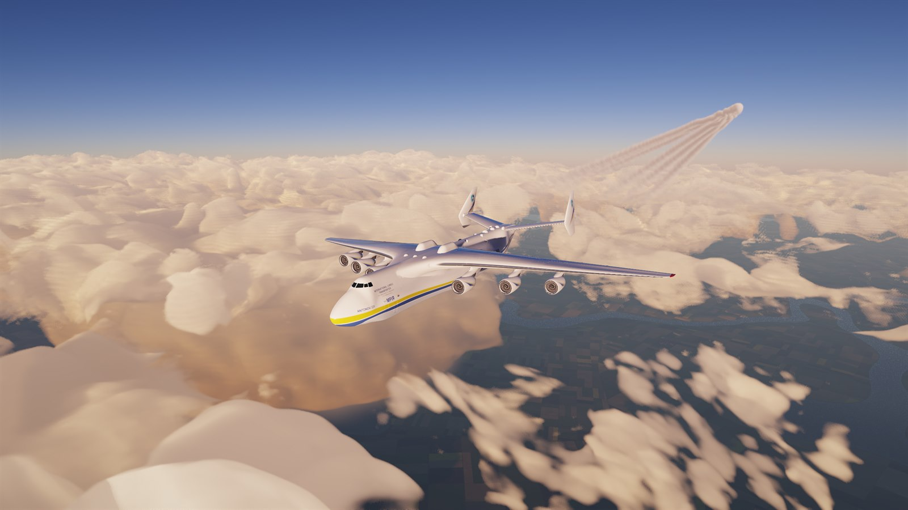
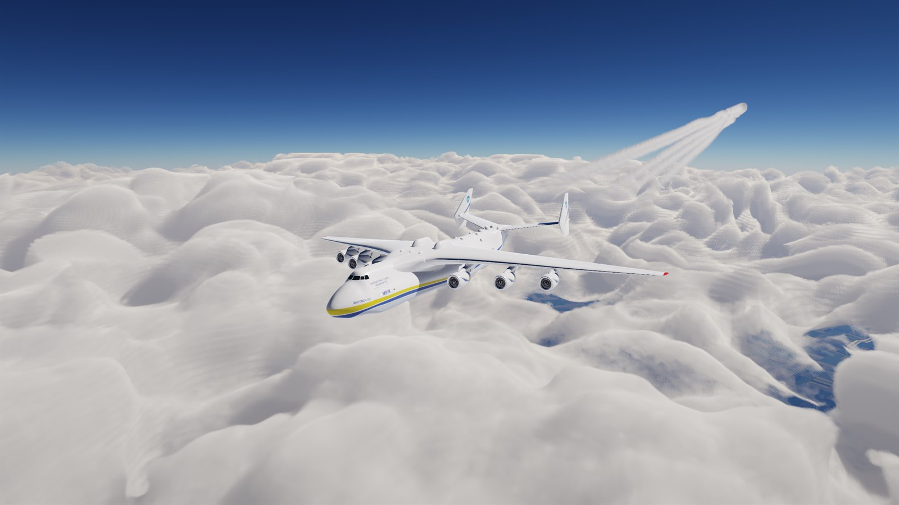
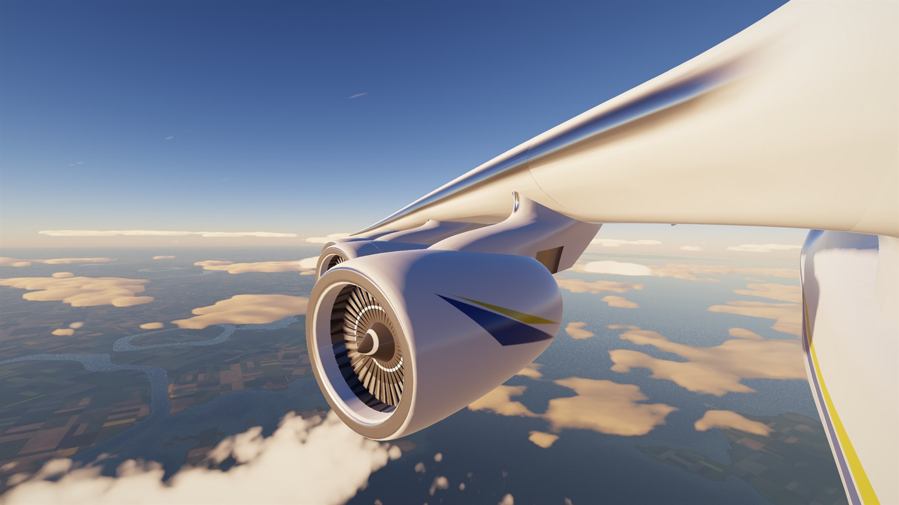
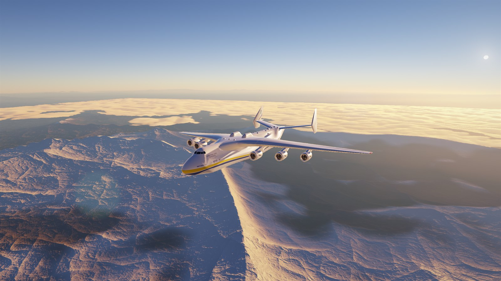
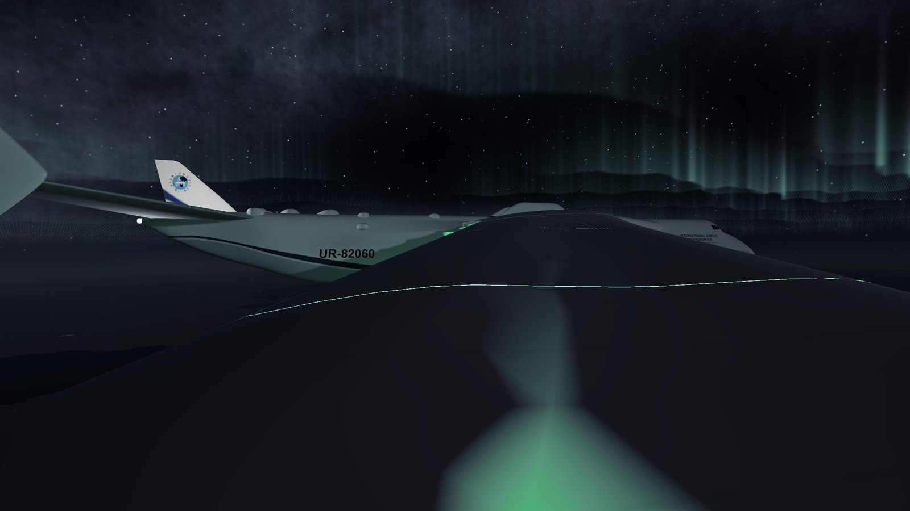
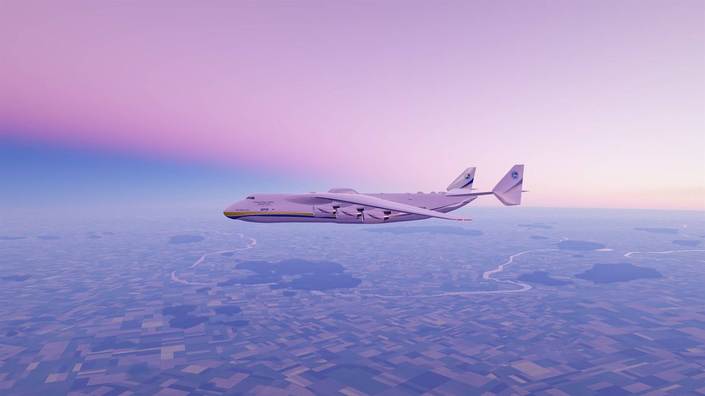
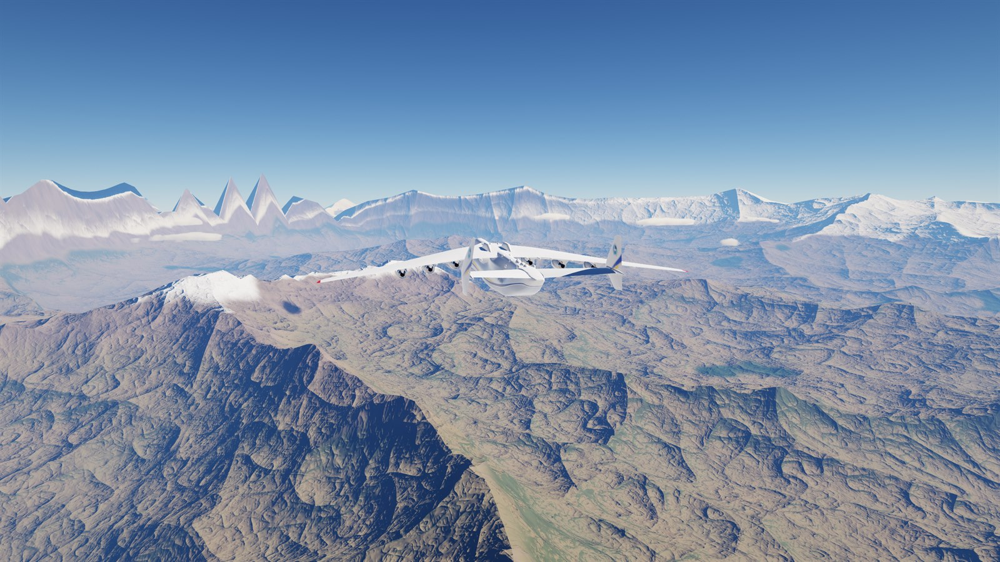
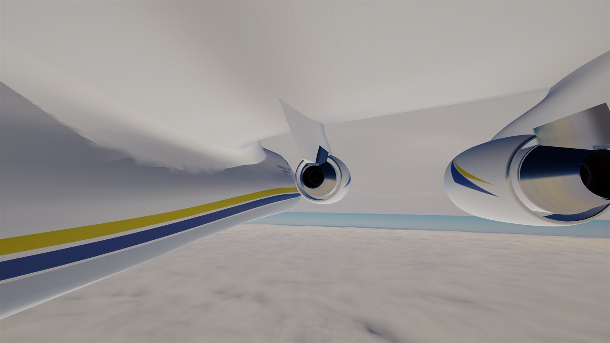
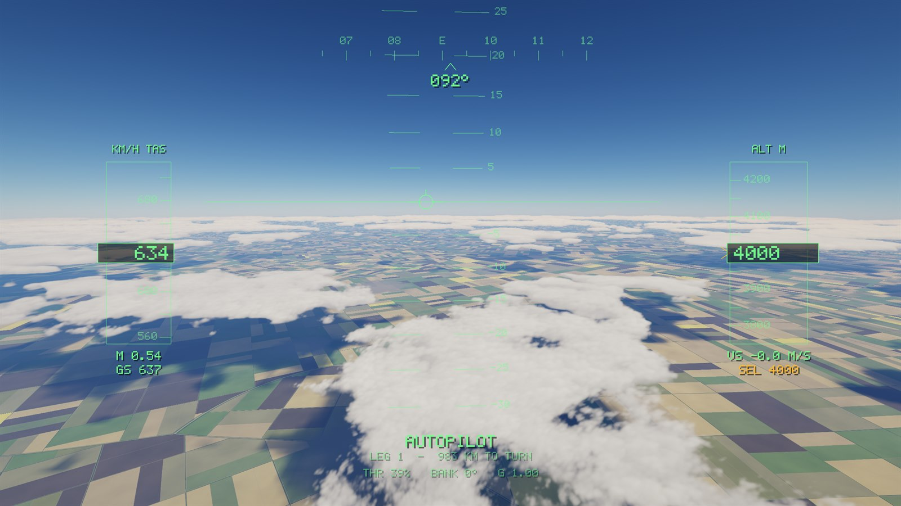
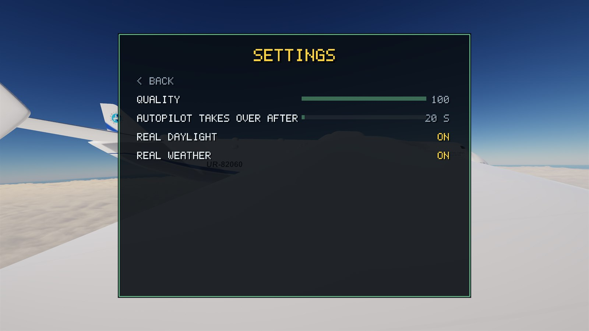

# Mriya

A 3D screensaver that flies you through volumetric clouds on the Antonov
An-225 *Mriya* - the largest aircraft ever built. Twenty-seven weather
scenarios, from a clear morning to a night thunderstorm and the aurora, change
gradually into one another over a procedural world; thirteen cameras ride the
airframe or fly alongside it; an autopilot flies a racetrack at changing
altitudes, and you can take the controls at any time with the keyboard, a
joystick - or from inside a VR headset.



**Windows: runs well, including in VR.** **Linux (XScreenSaver): the code and
scripts are written, but not yet tested on a Linux machine.**

| | |
|---|---|
|  |  |
|  |  |
|  |  |

The 3D engine and the tooling come from
[The Black Hole](https://github.com/ErickDoppler/Screensaver-TheBlackHole).

## What it does

* **Clouds** are raymarched volumes: two layers of heaped and flat cloud, a
  cirrus veil, rain shafts and lightning, lit by a physically based sky (the
  sun, the moon and its phase, multiple scattering) and casting shadows on the
  ground. Fly into one and the world goes grey. The shapes come from noise at
  three scales that is dragged about by slower noise, so a deck of cloud has
  waves and lumps in it but no pattern that repeats.
* **27 weather scenarios** - clear, cumulus, towering cumulus, thunderstorm,
  heavy rain, sea of clouds, sunset, sunrise, moonlit night, night storm,
  moonlit deck, cirrus, snowfall, haze, blue hour, desert dust, aurora,
  stratocumulus, altocumulus, tropical towers, between the layers, alpine,
  arctic day, drizzle, golden sea, stormy sunset and the Himalaya. None repeats
  until all have been shown. A change takes a minute: the sky turns and the
  ground reshapes itself under the aircraft - plains rising into ranges, the
  sea flooding in - then it holds for five.
* **The world** is procedural and endless: continents, eroded ridged
  mountains, hills, dunes, rivers, fields, forest, towns that light up at
  night, snow, and sea with sun glitter. The ground is one height function
  shared by the flight model and the renderer, so what the aircraft flies over
  is exactly what you see.
* **Real time.** Name a city and it can fly in that place's daylight, sun and
  moon, and its live weather (from [Open-Meteo](https://open-meteo.com), no
  account needed; only the place is sent). The two are separate switches:
  take its daylight and keep the scenery's own weather, take its weather and
  set the hour yourself, or both. They are the same two settings in the
  settings dialog, the F2 panel and the headset's menu - set in one, set
  everywhere, and saved. With the live weather a change of scenery moves the
  aircraft to new ground and leaves the sky alone - the weather of a real
  place is not ours to deal.
* **The aircraft** is a detailed model in the Antonov Airlines livery, drawn
  procedurally so every line is sharp at any distance: the cheatline and the
  grey belly measured off a reference texture, the engine swooshes measured off
  photographs, the titles set in type, glass windscreen panes, turning fans, a
  glowing turbine deep in each exhaust, working ailerons, elevators and rudders,
  wings that flex with the load, contrails, navigation lights and strobes, and
  the heat shimmer behind the engines.

  

* **Flight model.** A 300-640 t freighter with the real aircraft's power: the
  stick asks for a pitch rate (3 deg/s slow, 10 deg/s from 540 km/h), the
  ceiling is wherever the thrust runs out, and a terrain floor 50 m above the
  ground takes over gently if you dive at it. Weather is felt where the weather
  is: in cloud in a storm the wings work and rain beads on the glass, above the
  same storm's deck there is neither - and nothing shakes the airframe about,
  because three hundred tonnes and an 88 m wing do not judder.
* **VR.** With a headset plugged in it goes stereo through OpenXR, which both
  the Oculus runtime and SteamVR speak. The controllers turn, move and zoom the
  camera, change the camera and the scenery, and put up a menu panel in the
  world; the flight HUD hangs on the glass ahead, squared to the aircraft
  rather than to your head. Nothing moves the view by itself in a headset, and
  the horizon keeps only a tenth of the aircraft's roll and pitch. Tested on a
  Quest 2.
* **Thirteen cameras**, four views on most: the nose (with a flight HUD), the
  cockpit roof, the spine, the fin top, a wingtip, the side window, the chin,
  behind an engine, between the engines, the tailplane, a chase plane, a
  wingman, and a free orbit round the aircraft.
* **It behaves like a screensaver.** Automatic quality measures the frame time
  on the first run and settles the render scale, cloud resolution and step
  count so the GPU is busy for a third to a half of each frame - a quiet fan on
  a machine nobody is using. It runs on Intel integrated graphics, needs only
  OpenGL 3.3, is one file with no dependencies, and installs without
  administrator rights.

## Run it

### Windows

Everything is portable and open source. Nothing is installed system-wide
except the screensaver itself, no administrator rights are needed, and Visual
Studio is not needed.

1. **Get the build tools.** Downloads GCC ([w64devkit](https://github.com/skeeto/w64devkit)),
   CMake, Ninja and the SDL3 source into `C:\workenv`, checking every archive
   against a pinned SHA-256. Run it once; running it again only verifies what
   is already there.

   ```bat
   1-download-tools-windows.cmd
   ```

   To put the tools somewhere else, pass the folder
   (`1-download-tools-windows.cmd D:\tools`) and set `BH_WORKENV` to it before
   step 2.

2. **Build and install.** Compiles `build\win-mingw\Mriya.scr`, a single
   static executable with no runtime dependencies, checks it with Microsoft
   Defender, copies it to `%LOCALAPPDATA%\Mriya` and makes it the active
   screensaver for the current user. The first build takes a few minutes,
   because SDL3 is compiled from source.

   ```bat
   2-build-and-install-windows.cmd
   ```

Then open **Settings > Personalization > Lock screen > Screen saver** (or run
`control desk.cpl,,@screensaver`) to set the wait time; **Settings...** there
opens the screensaver's own options. The drop-down there lists only the
screensavers in `C:\Windows\System32`, so this one does not appear in it - it
is already selected, and picking any other entry replaces it.

**Install it with the script, not with Explorer's right-click "Install".**
The registry stores one path, and the script stores a permanent one. Explorer
pins the `.scr` wherever it happens to sit, so a copy in the build folder or
in Downloads stops working the moment it is deleted - and Windows then does
nothing at all on idle, without a word.

There is also a ready-built `Mriya-*-win64.zip` on the
[releases page](https://github.com/ErickDoppler/Screensaver-Mriya/releases) to
try before building. It is not code-signed, so SmartScreen may ask for
confirmation.

To look at it before installing, build with
`2-build-and-install-windows.cmd noinstall` and run
`build\win-mingw\Mriya.scr /w` for a window or `/s` for fullscreen. `Esc`
always exits.

#### It does not start, or something looks wrong

Every run writes a log to `%LOCALAPPDATA%\Mriya\last-run.log`: the graphics
card and driver, each start-up step, and the frame times. If it cannot start
its 3D graphics it says so in a message box that names the reason. On a laptop
with two graphics chips it runs on either; attach the log to an issue if it
misbehaves on yours.

#### Nothing happens on idle

The screensaver is whatever `SCRNSAVE.EXE` under `HKCU\Control Panel\Desktop`
points at. Check that path exists:

```powershell
Get-ItemProperty 'HKCU:\Control Panel\Desktop' | Select-Object 'SCRNSAVE.EXE', ScreenSaveActive, ScreenSaveTimeOut
```

* **It points at a file that is gone** - re-run `tools\install-windows.ps1`,
  which points it at the permanent copy.
* **`ScreenSaveTimeOut` is missing or 0** - Windows never starts a screensaver
  without one. The install script sets 600 seconds if it is unset.
* **Something is holding the display awake** - `powercfg /requests` lists what
  (a video call, a browser tab, a game).

### In a headset

Plug in a headset and start it as usual: if an OpenXR runtime is there and a
headset is connected, it goes stereo by itself and the window on the monitor
becomes a mirror of the left eye. Nothing needs installing beyond the runtime
you already use - the Oculus app or SteamVR - and no loader library is
shipped: the active runtime is found in the registry and loaded at start-up.

Because the runtime owns the display, the usual ways out are disabled in a
headset: a mouse button or a key will not end it, and **Alt+F4** is the way
out. Automatic camera rotation is off there too, and the picture is set for 90
frames a second.

### Linux

The screensaver runs inside [XScreenSaver](https://www.jwz.org/xscreensaver/),
which works on any X11 desktop (Xfce, MATE, Cinnamon, LXQt, i3 and others).
Debian/Ubuntu, Fedora, Arch and openSUSE are supported by the scripts.

> **Not yet tested on Linux.** The code and scripts are written, but have not
> yet been compiled or run on a Linux machine. VR is Windows-only for now.
> Please report anything that fails.

1. **Get the build tools.** Installs the compiler, CMake, Ninja, the X11,
   OpenGL and Wayland headers SDL3 needs, and XScreenSaver through your
   package manager (it asks for `sudo`), then downloads the pinned SDL3 source
   into `~/workenv`, checked against its SHA-256.

   ```sh
   ./1-download-tools-linux.sh
   ```

   Options: `--no-packages`, `--no-xscreensaver`, `--force`, or a different
   target folder as the first argument (then set `BH_WORKENV` to it for step 2).

2. **Build and install.** Compiles `build/linux/mriya`, installs it into
   XScreenSaver's program folder along with its settings page, and adds it to
   your `~/.xscreensaver` list (a backup is kept next to it).

   ```sh
   ./2-build-and-install-linux.sh
   ```

   If `~/.xscreensaver` does not exist yet, open `xscreensaver-settings` once
   and close it, then run the script again.

Then open `xscreensaver-settings` and pick **Mriya**. Real-time weather on
Linux uses `curl`.

To look at it before installing, build with
`./2-build-and-install-linux.sh --no-install` and run
`build/linux/mriya --window`.

**GNOME and KDE Plasma** have their own screen lockers, which cannot run
third-party screensavers. It still runs in a window there.

## Controls

Press **F1** at any time for this list on screen.

| Key | Action |
|---|---|
| W / S | nose down / nose up |
| A / D | roll left / right |
| Left / Right | rudder |
| PageUp / PageDown | more / less power |
| Ctrl+A | autopilot on / off |
| 1 - 9, 0, -, = | cameras: 1 nose, 2 between the engines, 3 spine, 4 fin, 5 wingtip, 6 cockpit roof, 7 side window, 8 chin, 9 behind the engine, 0 tailplane, - chase, = wingman |
| the same camera key again | turn round; on side cameras, then the other side of the aircraft |
| - again, or G | the globe: a free orbit round the aircraft |
| Mouse | look round (globe: orbit) |
| Mouse wheel | zoom (globe: distance) |
| Home or R | look straight again |
| Ctrl+Alt+C | next camera |
| Ctrl+Alt+S | next weather (in real time: fetch the weather now) |
| H | flight HUD on / off |
| Print Screen | save the frame to `Pictures\Mriya` and copy it to the clipboard |
| F1 | the key list |
| F2 | the settings panel |
| Esc | exit (always, except in a headset) |

### The flight HUD

**H** puts it up on any camera, and the nose camera carries it by default: an
attitude ladder with the flight path marker, speed and altitude tapes, Mach,
ground speed, vertical speed and the selected altitude, the compass, and what
the autopilot is doing.



### The settings panel (F2)

**F2** puts up the same menu the headset has, in the middle of the screen,
worked with the mouse: click a row, drag a slider, the wheel runs down the long
lists, **Escape** or **F2** puts it away. While it is up the screensaver will
not quit at a touch.



It holds the cameras, the scenery, the quality, the autopilot's timeout, the
real daylight and weather and the hour - and **Exit**. Quality set by hand
switches off the automatic adjustment for the rest of the run, and the hour
holds the sky until the scenery next changes. **Real daylight** and **Real
weather** are saved as soon as they are ticked, and are the same two settings
the dialog and the headset's menu show; the rest last for the run.

### Joystick

X and Y fly roll and pitch, a twist grip is the rudder and the throttle lever
sets the power. The first half of the stick's travel gives only a tenth of the
authority, for fine control, rising to all of it at the stops. Button 2 toggles
the autopilot. With a joystick connected the autopilot never takes over just
because you stopped touching things - only when you ask, or when the ground is
coming. Each axis can be inverted in the settings.

### In a headset

The controllers fly nothing - the aircraft flies itself, or the joystick flies
it - and work the view instead:

| Control | Action |
|---|---|
| Stick left / right | turn the view |
| Stick forward / back | zoom: the virtual camera's field of view narrows across the whole eye, and head tracking is untouched |
| Grip (middle finger) | grab the view and turn it |
| Grip + stick left / right | the scenery, one way or the other |
| Trigger (index finger) | grab the camera and slide it: any direction |
| Trigger + stick | turn the view and zoom, as the stick alone |
| Grip and trigger together | let go: back to where the camera's preset has it |
| Stick click | back to the first scenery |
| A / X | the next camera |
| B / Y | the menu, and away again |
| Trigger on the panel | work a row or a slider |
| Alt+F4 | exit |

The menu appears in front of wherever you are looking. Its **Settings** page
has the quality, the autopilot's timeout, the lens (Portrait, Normal,
Telescopic, Wide, Fisheye), the real daylight and weather, and the hour; a city
typed into the settings dialog is looked up from inside the headset if **Find**
was never pressed.

### The autopilot and the rotation

**The autopilot** flies a racetrack: 1000 km straight, a right turn 40 km
across, 1000 km back, picking a new altitude between 1000 and 11,000 m every
300 km. Touch the controls and the aircraft is yours; leave them for 20 seconds
and it takes back over, keeping your heading. Taken over below 2000 m above the
ground, it climbs back to that first.

**The cameras** rotate on their own, five minutes each and none repeating until
all have been shown - but only when nobody is there: not while you are flying
the aircraft, not for ten minutes after you pick a camera, not until nothing
has been touched for a minute, and never in a headset.

## Settings

On Windows the screensaver has its own dialog (**Settings...** in the Windows
screensaver page, or run the `.scr` with no arguments). On Linux the scenery,
flight and picture settings and the two real-time boxes are on the
XScreenSaver page; the rest, the city included, are `--<setting> <value>`
arguments there (`--rt-lat` and `--rt-lon`, in 1e-4 degrees).

| Group | What is in it |
|---|---|
| **Input** | whether the mouse looks around or exits, how far it must move to exit, and whether any key exits or the keys fly |
| **Flight** | whether the keys fly the aircraft, how long the autopilot waits, the racetrack's leg length and turn diameter, how often it changes altitude, time compression, and the aircraft's weight |
| **Scenery** | how often the weather and the camera change, the HUD (off, captions, full), metric or imperial, navigation lights, lens effects |
| **Picture** | field of view, glow, quality (0 = automatic) and a frame rate limit |
| **Real time** | the city to fly over, **Real daylight**, **Real weather**, and the hour the daylight slider starts at |
| **Joystick** | which axes to invert, and the name of the stick it found |

**The city is only a place.** Type it, press **Find**, and it is remembered;
on its own it changes nothing. What is taken from it is the two boxes beside
it: **Real daylight** puts the sun and moon where they really are over that
city, **Real weather** flies its live conditions, and either can be used
without the other. With neither ticked the scenery rotates as it always does.

**Those two are one setting each, wherever you set them** - this dialog, the
F2 panel or the headset's menu. Ticked in any of the three, they are saved at
once, are in force everywhere, and the next run starts with them.

**Every scenario brings its own hour** - that is what a sunset, a blue hour or
a night storm is - so **Time of day** does not hold the sky at one time all
run. Move it, in the F2 panel or the headset's menu, and it takes the sky over
from that moment until the scenery next changes; the new scenario then gets
its own light back. With **Real daylight** on, the place's real clock is in
charge instead and the hour is greyed out.

**Ctrl+Alt+S** in the dialog reveals two more pickers and grows the window:
which of the 27 scenarios and which of the 13 cameras take part in the
rotation.

Settings persist in `HKCU\Software\Mriya` on Windows and in
`~/.config/mriya/settings.conf` on Linux.

## Uninstall

Windows. Add `-Purge` to also remove the saved settings in
`HKCU\Software\Mriya`:

```powershell
powershell -ExecutionPolicy Bypass -File tools\install-windows.ps1 -Uninstall
```

Linux. Settings in `~/.config/mriya` are kept:

```sh
./2-build-and-install-linux.sh --uninstall
```

## Build options

**Windows:** `2-build-and-install-windows.cmd` accepts, in any order:

| Argument    | Effect                                                      |
|-------------|-------------------------------------------------------------|
| `debug`     | symbols, no stripping, into `build\win-mingw-debug`         |
| `clean`     | delete the build folder first (full rebuild)                |
| `noinstall` | build only (`tools\build-windows.cmd` is a shortcut for it) |
| `noscan`    | skip the Defender check                                     |

By hand, with the toolchain on PATH:

```bat
call tools\env.cmd
cmake --preset win-mingw
cmake --build --preset win-mingw
powershell -ExecutionPolicy Bypass -File tools\install-windows.ps1
```

**Linux:** `2-build-and-install-linux.sh` accepts `--debug`, `--clean`,
`--no-install`, `--system-sdl` (link the distribution's SDL3 3.2+),
`--prefix DIR` and `--uninstall`.

The aircraft model, `res/models/Mriya.glb`, is packed at build time by
`tools/meshpack.c` (a small host program the build compiles first): welded,
smoothed, split into parts, the windscreen panes and exhaust plugs found, and
linked straight into the executable. The livery data - `res/textures/decals.tex`,
`src/decals_atlas.h`, `src/bands_table.h` and `res/win32/mriya.ico` - is
generated by the Python tools in `tools/` and committed, so a build needs no
Python. Re-running those tools needs numpy and Pillow and the reference images
they read (not in the repository: a kit decal sheet and the texture of another
An-225 model, which are not ours to redistribute).

The OpenXR headers in `third_party/openxr/` are the Khronos ones; there is no
loader to build or ship.

## Windows Defender

A freshly compiled, unsigned `.scr` can trip Defender's machine-learning
heuristics. The build avoids what those heuristics score: it never polls the
global keyboard (the settings dialog's hidden `Ctrl+Alt+S` is read from its
own message queue), never starts other programs or relaunches itself, drops
SDL's dynamic-API layer and unused code, and is stripped, statically linked,
ASLR- and DEP-enabled, with full version information and a manifest.

It does open two network connections, and only when a place is being flown
over: HTTPS to `geocoding-api.open-meteo.com` to turn a city's name into
coordinates, and to `api.open-meteo.com` every fifteen minutes while it runs.

If Defender still flags it, report the false positive at
https://www.microsoft.com/wdsi/filesubmission ("Software developer"), and
meanwhile restore it from **Windows Security > Protection history** and add
an exclusion for `%LOCALAPPDATA%\Mriya`.

## Command line

Windows calls the screensaver with `/s` (fullscreen across all monitors),
`/p <hwnd>` (the preview in the Windows dialog) or `/c` (settings, also the
default). XScreenSaver runs it with `-root`.

Developer switches (both platforms):

| Switch | Meaning |
|---|---|
| `/w` or `--window 1600x900` | run in a resizable window |
| `--dump out.png --frames 90` | render 90 frames, save the last one, exit |
| `--weather <name>` | start on one scenario (names below) |
| `--camera <name>` | start on one camera (names below) |
| `--alt 3000` | start at this altitude, metres |
| `--advance 60` | run the simulation ahead before drawing, seconds |
| `--view x y z yaw pitch fov` | put the camera anywhere (body frame, metres, degrees) |
| `--look yaw pitch` | force the look-around, degrees |
| `--seed 1234` | fix the run's random seed |
| `--stick pitch roll from to` | hold the stick between two times, for testing the handling |
| `--show-keys` | start with the F1 key list up |
| `--show-menu [page]` | start with the F2 settings panel up (3 = its settings page) |
| `--trace` | log the flight every 15 frames |
| `--log file.txt` | append diagnostics to a file |
| `--<setting> <value>` | override any setting, e.g. `--weight 640 --time-scale 10` |

On Windows, launching a `.scr` from Explorer replaces its arguments with
`/S`. To pass developer switches, run it from `cmd`, or copy it to a `.exe`.

A run that must show one scenario's own sky needs the live weather out of the
way: `--no-rt-weather --no-rt-daylight`, or the saved place's conditions
replace whatever `--weather` asked for.

Weather names: `clear`, `cumulus`, `towering`, `thunderstorm`, `heavy-rain`,
`cloud-sea`, `sunset`, `sunrise`, `moonlight`, `night-storm`, `night-deck`,
`cirrus`, `snowfall`, `haze`, `blue-hour`, `dust`, `aurora`, `stratocumulus`,
`altocumulus`, `tropical`, `between-layers`, `alpine`, `arctic-day`,
`drizzle`, `golden-sea`, `stormy-sunset`, `himalaya`.

Camera names: `nose`, `belly`, `spine`, `fin`, `wingtip`, `cockpit`,
`window`, `chin`, `engine`, `tailplane`, `chase`, `wingman`, `globe`.

Setting keys (see `src/settings.h` for ranges and defaults):
`mouse-rotation`, `exit-on-mouse-move`, `mouse-sensitivity`,
`exit-on-any-key`, `manual-flight`, `autopilot-resume`, `joy-invert-roll`,
`joy-invert-pitch`, `joy-invert-throttle`, `joy-invert-rudder`,
`weather-minutes`, `camera-minutes`, `scene-mask` (e.g. `sunset,aurora`),
`rt-lat`, `rt-lon` (1e-4 degrees), `rt-daylight`, `rt-weather`, `time-of-day`
(minutes past midnight), `camera-mask`, `leg-km`, `turn-km`,
`altitude-change-km`, `time-scale`, `weight`, `fov`, `bloom`,
`lens-effects`, `nav-lights`, `hud`, `units`, `quality` (0 = auto), `fps`.
Boolean settings also take `--no-<key>`.

## Layout

```
1-download-tools-windows.cmd   toolchain into C:\workenv (Windows)
2-build-and-install-windows.cmd build, Defender check, install (Windows)
1-download-tools-linux.sh      packages + SDL3 source into ~/workenv (Linux)
2-build-and-install-linux.sh   build, install into XScreenSaver (Linux)
src/            portable C11 core (SDL3 + OpenGL 3.3), platform_win32.c / platform_linux.c
src/vr.c        OpenXR: the runtime, the session, the eyes, the controllers
src/vrmenu.c    the menu, on a panel in the world or on the screen
src/shaders/    GLSL, embedded into the binary at build time
res/models/     the aircraft (glTF binary), packed at build time
res/textures/   the livery's decal atlas
res/win32/      dialog, manifest, icon, version info
res/linux/      XScreenSaver settings page
cmake/          toolchain file + shader embedding script
tools/          env / build / install scripts, meshpack, livery and icon
                generators, and test_weather.c, a stress test for the rotation
docs/           design notes and screenshots
third_party/    stb_image_write.h (public domain), the OpenXR headers
```

See [docs/DESIGN.md](docs/DESIGN.md) for how it is drawn and flown, and
[CONTRIBUTING.md](CONTRIBUTING.md) for how to send a change.

## License

MIT for the code. The aircraft model `res/models/Mriya.glb` is included for
building the screensaver. Dependencies: SDL3 (zlib), stb (public domain /
MIT), the OpenXR headers (Apache 2.0, Khronos). Build tools: w64devkit / GCC
(GPL with runtime exception), CMake (BSD), Ninja (Apache 2.0). Weather data:
[Open-Meteo](https://open-meteo.com) (CC BY 4.0).
